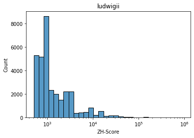

# hse22_project

https://colab.research.google.com/drive/1KzJPp-1LYaZ07g2PTYvjJtKxdbA84oc2?usp=sharing

Входные данные

| геном | **GC%** | файл |
| --- | --- | --- |
| Enterobacter chengduensis | 55,7203 | GCF_001984825 |
| Enterobacter ludwigii | 54,6038 | GCF_001750725 |
| Enterobacter oligotrophicus |54,3 | GCF_009176645 |
| Enterobacter sichuanensis | 55,5 | GCF_009036245 |
| Enterobacter soli | 53,8376 | GCF_000224675 |

Анализ аннотированных геномов

| | Gene number | Gene length | Exon length |Exone coverage |
| --- | --- | --- | --- | --- |
| GCF_000224675 | 4783.0 | 5012132.0 | 4460161.0 | 89.0 |
| GCF_001750725 | 4704.0 | 4952770.0 | 4429118.0 | 89.4 |
| GCF_001984825 | 4994.0 | 5218125.0 | 4632272.0 | 88.8 |
| GCF_009036245 | 4507.0 | 4711389.0 | 4212957.0 | 89.4 |
| GCF_009176645 | 4259.0 | 4476585.0 | 4003117.0 | 89.4 |

 Гистограммы
 
| name | img |
| ---- | --- |
| chengduensis |  |
| ludwigii |  |
| obligotrophicus |  |
| sichuanensis |  |
| soli |  |

Гомологичные кластеры

Всего найдено 4362 кластера

функции генов

| name | img |
| ---- | --- |
| chengduensis |  |
| ludwigii |  |
| sichuanensis |  |
| soli |  |

Z-dna

| name | img |
| ---- | --- |
| chengduensis |  |
| ludwigii |  |
| obligotrophicus |   |
| sichuanensis |  |
| soli |  |

белковые выравнивания
- [выравнивание](aligned/aligned_cluster_564.aln)
- [выравнивание](aligned/aligned_cluster_876.aln)
- [выравнивание](aligned/aligned_cluster_2190.aln)
- [выравнивание](aligned/aligned_cluster_2684.aln)

расположение Z-DNA относительно гомологичных генов

| _ |
| --- |
|  |
|  |
|  |